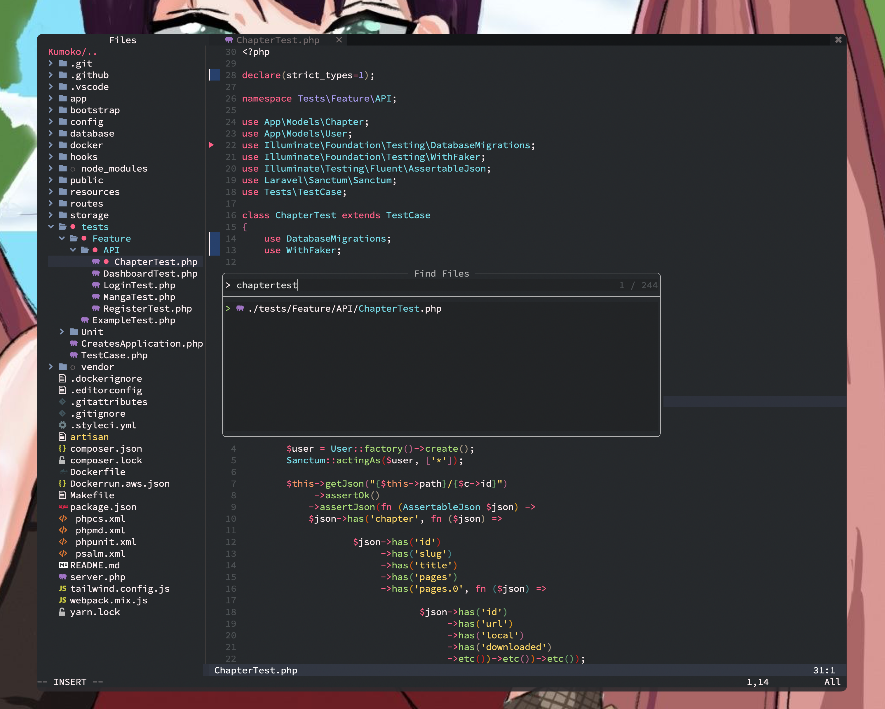
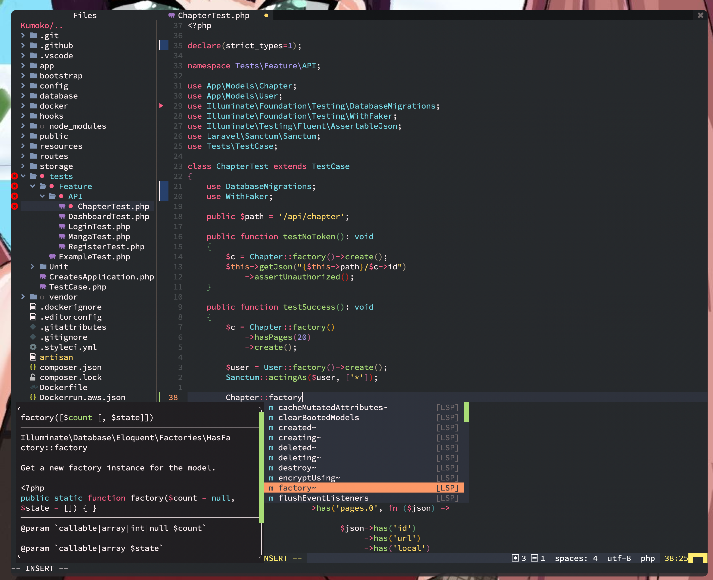

I love vim. It gives me the same development environment via SSH even I am working on my iPad or a computer that I don't normally use. But VSCode is good too, it can do pretty much anything that any other IDE does and it does it fast. VSCode is also very popular which makes the extension space really good. You can pretty much find any extension or theme that you want or need. But I can't use it nor any other non-terminal editor thanks to Tmux. I need at least 3-4 panes open next to my editor and I need this setup replicated for all the projects I am currently working. Considering that I have like 9 repos only on Poltio that I actively work on (thanks to microservices) VSCode and any other viable editor is not as productive as for me as working with Vim+Tmux.

And even tho I love trying new things and used all popular editors and IDEs, my main editor of choice remained Vim for the last 15+ years. And I switched to [Neovim](https://neovim.io/) couple of years ago but I was still using my old config/plugins written in [Vimscript](https://learnvimscriptthehardway.stevelosh.com/). Vimscript is not very developer friendly and I never was too into learning it. I copied and pasted lots of lines in vimscript as any good developer but never learn to actually use it.

I was already hearing gospels for [Lua](https://www.lua.org/docs.html) from the nvim and redis communities and I was curious, since using an actual mature programming language as your config will bring lots of flexibility.

So, I did end up writing my new nvim config completely with Lua and used plugins that were mostly written in Lua instead of using old vimscript versions.

I am so happy with the end result, it became a new fresh wind and boosted my productivity. (not because it's so much faster or better then my previous setup but because it's new and shiny :) )

Here is the relevant PR for my dotfiles: https://github.com/gcg/dotfiles/pull/1 And you can find the most up to date version of my dot files from the same repo.

### Notes;

- Switching to built in language server (LSP) from CoC is really faster for most of the cases.
- [Null-ls.nvim](https://github.com/jose-elias-alvarez/null-ls.nvim) is better then [Ale](https://github.com/dense-analysis/ale)
- Pretty much all plugins written in vimscript will keep working even if you use lua 100%.
- Configuring plugins and settings in Lua is way easier to understand (especially if you don't know vimscript)
- Lua is not OCD about most of the styles so if you are OCD and use a standard writing style, configure something like [StyLua](https://github.com/JohnnyMorganz/StyLua) (it's eslint / gofmt / prettier / phpcs for lua )
